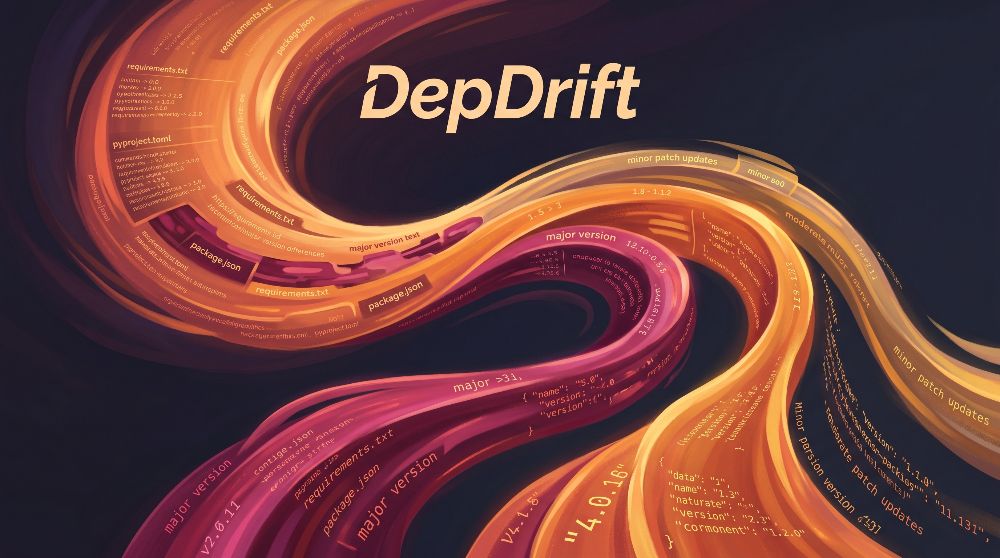

<p align="center">
  
</p>

<h3 align="center">CLI tool that reads requirements.txt/pyproject.toml/package.json and reports how far behind each dependency is from latest, grouped by severity (patch/minor/major). JSON or terminal table output.</h3>

<p align="center">
  <a href="#quick-start">Quick Start</a> &bull;
  <a href="#features">Features</a> &bull;
  <a href="#examples">Examples</a> &bull;
  <a href="#contributing">Contributing</a>
</p>

## What is this?
DepDrift is a command‑line utility that scans Python and Node dependency files to determine how outdated each package is, categorizing the gap into patch, minor, or major version differences. It helps solo developers quickly assess dependency staleness without needing external services.  
Example:
```
$ depdrift check --format table requirements.txt
+----------+------------+-----------+----------+
| Package  | Current    | Latest    | Severity |
|----------|------------|-----------|----------|
| requests | 2.25.1     | 2.31.0    | minor    |
| django   | 4.0.0      | 4.2.0     | minor    |
| numpy    | 1.22.0     | 2.0.0     | major    |
+----------+------------+-----------+----------+
```

## Problem
Dependency staleness accumulates silently in projects, especially those maintained by solo developers. Existing tools such as Dependabot and Renovate require hosted infrastructure; there is no simple CLI that provides a local staleness report.

## Features
| Feature | Description |
|---------|-------------|
| Multi‑format parsing | Reads requirements.txt, pyproject.toml, and package.json |
| Live version lookup | Queries PyPI and npm registries forlatest versions |
| Semantic severity grouping | Classifies drift as patch, minor, or major |
| Flexible output | Human‑readable table or machine‑friendly JSON |
| Auto‑detect | Finds a dependency file in the current directory if none is given |
| Graceful unknown‑package handling | Skips packages not present in registries |
| CI‑friendly JSON mode | Can be forced via `DEPDRIFT_OUTPUT=json` |
| Scriptable exit code | Returns non‑zero when any outdated dependency is found |

## Quick Start
1. Clone the repository:  
   `git clone https://github.com/<your-user>/DepDrift.git`
2. Install the package in editable mode:  
   `cd DepDrift && pip install -e .`
3. Run a basic check:  
   `depdrift check`

## Examples
**Example 1 – Table output for a Python project**  
Command:  
`depdrift check --format table requirements.txt`  
Output:  
```
+----------+------------+-----------+----------+
| Package  | Current    | Latest    | Severity |
|----------|------------|-----------|----------|
| requests | 2.25.1     | 2.31.0    | minor    |
| django   | 4.0.0      | 4.2.0     | minor    |
| numpy    | 1.22.0     | 2.0.0     | major    |
+----------+------------+-----------+----------+
```

**Example 2 – JSON output for a Node project**  
Command:  
`depdrift check --format json package.json`  
Output:  
```json
{
  "lodash": {"current": "4.17.15", "latest": "4.17.21", "severity": "patch"},
  "express": {"current": "4.17.1", "latest": "5.0.0", "severity": "major"},
  "react": {"current": "17.0.2", "latest": "18.2.0", "severity": "major"}
}
```

**Example 3 – Auto‑detect and suppress unknown packages**  
Command:  
`depdrift check`  
Output (when a pyproject.toml is present):  
```
+----------------+------------+-----------+----------+
| Package        | Current    | Latest    | Severity |
|----------------|------------|-----------|----------|
| fastapi        | 0.68.0     | 0.103.0   | minor    |
| pydantic       | 1.8.2      | 2.5.0     | major    |
+----------------+------------+-----------+----------+
```

## File Structure
```
DepDrift/
├── depdrift/          # Source code (CLI, parsers, version logic, output)
│   ├── __init__.py
│   ├── __main__.py    # Entry point
│   ├── main.py
│   ├── models.py
│   ├── output.py
│   ├── parsers.py
│   ├── utils.py
│   └── version.py
├── tests/             # Unit tests
│   ├── test_output.py
│   ├── test_parsers.py
│   └── test_version.py
├── assets/            # Infographic used in README
│   └── infographic.png
├── screenshots/       # Verification screenshots (not required for users)
├── .gitignore
├── init.sh            # Setup script
└── README.md
```

## Tech Stack
| Technology | Purpose |
|------------|---------|
| Python 3.9+ | Core language |
| requests   | HTTP client for PyPI and npm registries |
| packaging  | Version parsing and comparison |
| toml       | Parsing pyproject.toml files |
| json (std‑lib) | JSON output generation |

## Contributing
1. Fork the repository.  
2. Create a feature branch (`git checkout -b feature/foo`).  
3. Make changes, add tests, and ensure the test suite passes.  
4. Submit a pull request for review.

## License
MIT

## Author
Matthew Snow -- [M2AI](https://m2ai.co) | [@m2ai-portfolio](https://github.com/m2ai-portfolio)